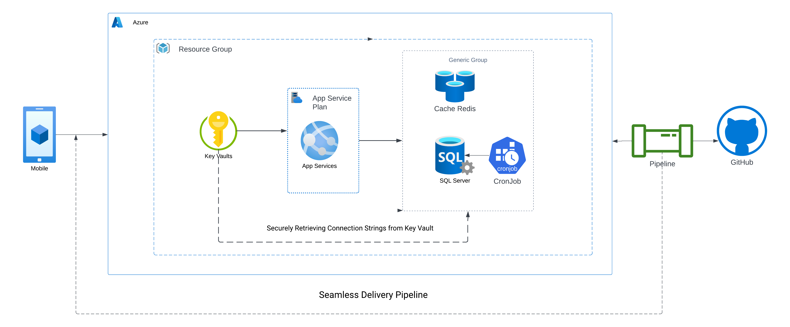

# **Pawsome**

This project aims to develop a comprehensive pet management application that includes key features such as an adoption module following the RSVP model, a daily meal tracker with personalized meal plans, recommendations for pet food based on daily meals, daily news updates relevant to pet owners, and an efficient event management system. This application will provide a seamless and user-friendly experience for pet owners, simplifying their pet care routines and enhancing their connection with the pet community.

# **Features**

- Streamline the pet adoption process with ease and simplicity.
- Experience personalized meal tracking and planning for your furry friend.
- Receive smart and tailored food recommendations for your pet's specific needs.
- Stay up-to-date with daily news updates catered to pet owners.
- Effortlessly manage and organize pet-friendly events with our intuitive event management feature.

# **Architectural Diagram**

